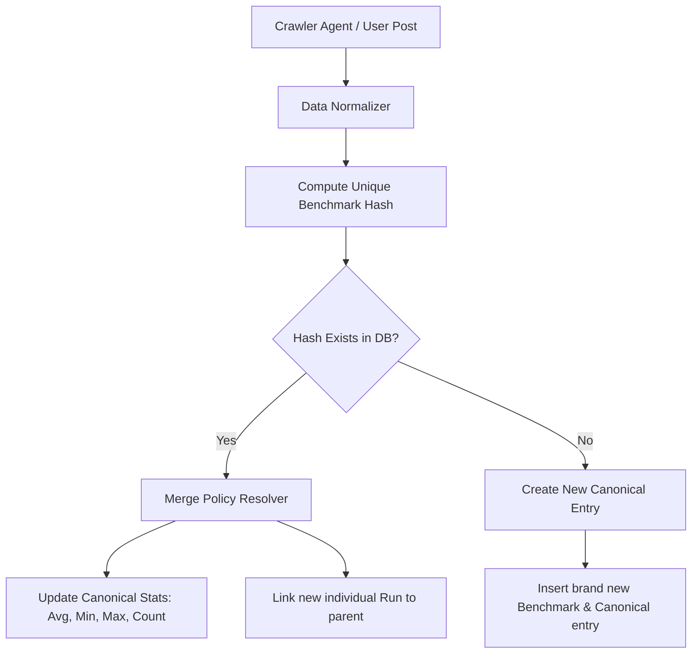

# Deduplication & Agent Merging Engine Specification

This specification defines the architectural design, normalization rules, and merge policies for the **LLMDB Deduplication Engine**. As automated agents crawl and ingest benchmarks from Hugging Face blogs, GitHub, Reddit, and Discord, this engine prevents catalog pollution, eliminates spam, and groups variations into statistically sound canonical records.

---

## 🧭 1. Architectural Overview

To prevent duplicate clutter, we divide benchmarks into two logical entities:
1.  **Individual Benchmark Run (Child Record)**: The raw user or crawler submission. Tracks specific speeds, trust confidence, and raw logs.
2.  **Canonical Benchmark Aggregate (Parent Record)**: The grouped, deduplicated entry shown on the search catalog dashboard. Tracks averages, minimums, maximums, and community sample sizes for a specific hardware/model/quantization/settings layout.



---

## 🔑 2. The Benchmark Hash (Deduplication Identity Key)

Every incoming benchmark is fingerprint-mapped to a unique `benchmark_hash` computed deterministically using the following formula:

```
benchmark_hash = SHA256(
  NormalizedModelName + 
  NormalizedEngine + 
  NormalizedQuantization +
  NormalizedLoadPrecision +
  NormalizedGPUSignature +
  NormalizedCPUSignature +
  ContextLength + 
  MLAFlag + 
  SpeculativeMethod + 
  SpeculativeTokensCount + 
  ChunkedPrefillFlag + 
  FlashAttentionFlag
)
```

---

## 🧹 3. Text Normalization Rules

To ensure identical hardware and configurations map to the same hash, all inputs must run through the following normalization filters prior to hashing:

### A. GPU Model Normalization
- Convert all text to lower-case.
- Remove high-frequency retail marketing fluff: `geforce`, `graphics`, `edition`, `super`, `ti`, `pcie`, `active`, `ultra`.
- Trim excessive spacing and replace spaces with a single hyphen.

*Examples:*
- `"NVIDIA GeForce RTX 4090"` ➔ `"nvidia-rtx-4090"`
- `"NVIDIA RTX 4090 Ti"` ➔ `"nvidia-rtx-4090"`
- `"Apple M3 Max GPU (30-core)"` ➔ `"apple-m3-max-30-core"`
- `"AMD Radeon RX 7900 XTX"` ➔ `"amd-radeon-rx-7900-xtx"`

### B. Model Name Normalization
- Isolate the publisher name and core model slug.
- Ignore specific file extensions (e.g. `.gguf`, `.llamafile`).

*Examples:*
- `"meta-llama/Meta-Llama-3.1-8B-Instruct-Q4_K_M.gguf"` ➔ `"meta-llama-3.1-8b-instruct"`
- `"DeepSeek-V3"` ➔ `"deepseek-v3"`

### C. Optimization Flags Normalization
- All boolean configuration switches are normalized to binary characters: `true ➔ "1"`, `false ➔ "0"`.

---

## 📋 4. Conflict Resolution & Merging Policies

When an agent or user submits a benchmark whose `benchmark_hash` matches an existing database entry, the engine applies the following merge filters:

### Policy A: Identical Timings Safeguard (Spam Filter)
If the submitted prompt evaluation speed and token generation speed are within **±1%** of an existing run submitted by the *same user* or *same crawling agent*, the submission is identified as a duplicate submission.
- **Action**: Silently skip insertion. Return `200 OK` with the existing record ID to prevent scraper loops from piling redundant data.

### Policy B: Crawler Source Safeguard
Every agent submission must include a `source_url` (e.g. Hugging Face blog post URL or Reddit thread link).
- **Action**: If a benchmark with the exact same `benchmark_hash` and `source_url` already exists, overwrite the existing record with the new one. Do not create a duplicate child run, as it represents a scrape of the same source.

### Policy C: Multi-Sample Aggregate Merging
If the benchmark hash matches but the timing speeds are different:
- **Action**:
  1. Insert the new submission as an **Individual Run** linked to the parent **Canonical Benchmark** record.
  2. Recalculate and update the **Canonical Parent's** running metrics:
     $$\text{average\_tps} = \frac{\sum \text{runs.tps}}{\text{count}}$$
     $$\text{min\_tps} = \min(\text{runs.tps})$$
     $$\text{max\_tps} = \max(\text{runs.tps})$$
     $$\text{run\_count} = \text{run\_count} + 1$$

---

## 💾 5. Database Schema Schema Enhancements

To implement these safeguards, the following columns must be added to the Drizzle schema in [`docs/system_architecture/data_models.md`](file:///c:/git/pi/llmdb/docs/system_architecture/data_models.md):

```diff
===================================================================
--- docs/system_architecture/data_models.md
+++ docs/system_architecture/data_models.md
@@ -10,13 +10,17 @@
   - `id` (`string`, uuid, primary key)
+  - `canonical_benchmark_id` (`string`, uuid, foreign key pointing to canonical aggregates)
   - `user_id` (`string`, uuid, nullable)
   - `raw_log_content` (`string`, text, nullable)
   - `confidence_score` (`decimal`, 0.0 to 1.0)
+  - `benchmark_hash` (`string`, unique index)
+  - `source_url` (`string`, varchar, nullable)
   - `created_at` (`timestamp`)
 
+### Canonical Benchmark Aggregates Table [NEW]
+  - `id` (`string`, uuid, primary key)
+  - `benchmark_hash` (`string`, unique)
+  - `average_generation_tps` (`decimal`)
+  - `min_generation_tps` (`decimal`)
+  - `max_generation_tps` (`decimal`)
+  - `average_prompt_tps` (`decimal`)
+  - `sample_run_count` (`integer`)
+  - `updated_at` (`timestamp`)
```
